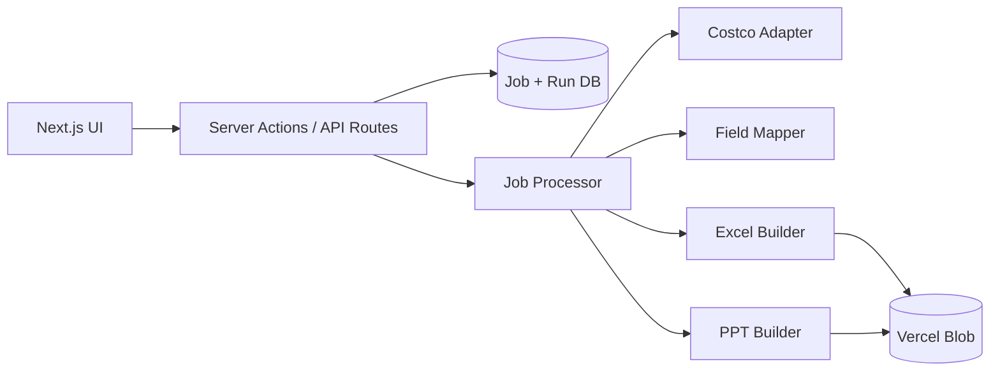

# Workflow Automate

## Overview

Personal Next.js command center for daily automation workflows. Replaces repetitive multi-tool routines (API fetch → Excel pivot → PowerPoint update) with one orchestrated pipeline.

**First workflow (MVP):** Costco product search by keyword (e.g. "coconut") → filter/map fields → generate Excel (product name, original price, promotional price, manufacturer, expiry date, etc.) with summary/pivot sheet → update PowerPoint slide for ongoing products using a user-provided template.

**Primary user:** Single operator (personal productivity tool, not multi-tenant SaaS in v1).

---

## Goals & Success Metrics

| Metric | Target |
|--------|--------|
| **North star:** Time from search submit to downloadable Excel + PPT | < 5 min automated; < 2 min active user time |
| Successful run rate | ≥ 90% without manual fixes |
| Manual steps vs today | ≥ 80% reduction |

---

## Users & Core Journeys

### Persona
**Ops Analyst** — runs Costco product reports weekly or ad hoc; needs exports matching existing Excel/PPT formats.

### MVP flow
1. Open dashboard → select **Costco Product Report**
2. Enter search term → **Run**
3. Monitor job progress (fetch → transform → Excel → PPT)
4. Download `.xlsx` and `.pptx`
5. View run history and re-download prior artifacts

---

## Features

### MVP
| Feature | Acceptance criteria |
|---------|---------------------|
| Workflow dashboard | Lists Costco pipeline; shows last run status/timestamp |
| Costco search | Keyword submit triggers adapter fetch; empty/error states |
| Field mapping | Config-driven map to: `productName`, `originalPrice`, `promotionalPrice`, `manufacturer`, `expiryDate`, `sku`, `category` |
| Excel export | **Data** sheet + **Summary** sheet (pivot-equivalent aggregation + chart) |
| PPT export | User template updated on designated slide(s) for ongoing products |
| Async jobs | DB-backed jobs survive serverless timeouts; UI polls status |
| Artifacts | Files stored (Vercel Blob / local dev); downloadable from UI |
| Run history | Last N runs with term, date, status, links |

### Future
- Workflow registry for additional daily automations
- Scheduled/cron runs
- Python sidecar for native Excel pivot fidelity if needed
- Optional auth if deployed beyond personal use

---

## Tech Stack & Architecture

| Layer | Choice | Notes |
| --- | --- | --- |
| Framework | **Next.js** (App Router) | RSC + Server Actions |
| Styling | **Tailwind CSS** | Mobile-first |
| Database | **PostgreSQL** via **Vercel Postgres** | Jobs, runs, config |
| ORM | **Prisma** | `prisma/schema.prisma` |
| Validation | **Zod** | API boundaries |
| Excel | **exceljs** | Data + summary + chart |
| PPT | **pptxgenjs** (or python-pptx sidecar) | Template replacement |
| Storage | **Vercel Blob** | Generated artifacts |
| Deployment | **Vercel** | Preview + production |

### Architecture principles
- **Server-first:** Server Components default; client only for forms, polling, interactivity.
- **Adapter pattern:** Costco behind `CostcoProductSource` interface — isolates unofficial/scraped APIs.
- **Async jobs:** Long file generation runs in job processor, not synchronous server actions.
- **Template-driven PPT:** User provides `.pptx` template; system fills placeholders — not slide-from-scratch.
- **Pre-computed pivot:** Summary sheet + chart in code; native Excel PivotTable deferred unless user requires it.
- **Secrets:** Costco credentials and API keys server-only (`.env.local` / Vercel env).



### Components
- `workflows/` — registry + Costco pipeline orchestration
- `lib/adapters/costco/` — product fetch + normalize
- `lib/mappers/` — config-driven field mapping
- `lib/exporters/excel/` — exceljs data + summary builder
- `lib/exporters/ppt/` — template loader + slide updater
- `lib/jobs/` — create, poll, execute pipeline steps

---

## Data & Integrations

### Prisma models (MVP sketch)

```prisma
model WorkflowRun {
  id          String   @id @default(cuid())
  workflowId  String   // e.g. "costco-product-report"
  searchTerm  String
  status      String   // pending | running | completed | failed
  error       String?
  createdAt   DateTime @default(now())
  completedAt DateTime?
  artifacts   Artifact[]
}

model Artifact {
  id        String   @id @default(cuid())
  runId     String
  run       WorkflowRun @relation(fields: [runId], references: [id])
  type      String   // xlsx | pptx
  url       String
  filename  String
  createdAt DateTime @default(now())
}
```

### Integrations
| Integration | Pattern | Location |
| --- | --- | --- |
| Costco product source | Adapter (TBD: API/scrape) | `lib/adapters/costco/` |
| Artifact storage | Vercel Blob SDK | `lib/storage/` |
| Health check | GET | `app/api/health/route.ts` |

### Canonical product schema (Zod)
`productName`, `originalPrice`, `promotionalPrice`, `manufacturer`, `expiryDate`, `sku`, `category` — extensible via workflow config JSON.

---

## Non-Functional Requirements

- **Performance:** Runs with < 200 products complete within 5 minutes.
- **Security:** No credentials in client bundle; validate all external input with Zod.
- **Accessibility:** Form labels, job status updates for screen readers.
- **Compliance:** Personal use; user owns Costco data access.

---

## Implementation Phases

### Phase 1 — Environment initialization
- Bootstrap Next.js + TypeScript + Tailwind + Prisma
- Health check, base layout, workflow dashboard shell

### Phase 2 — Database & jobs
- `WorkflowRun`, `Artifact` models + migrations
- Job processor with status polling API

### Phase 3 — Costco pipeline (MVP core)
- Costco adapter spike (requires user API details)
- Field mapper + Zod validation
- Excel builder (data + summary + chart)
- PPT builder (user template)
- Run form, progress UI, downloads, history

### Phase 4 — Platform extensibility
- Workflow registry for automation #2+
- Optional cron; Python sidecar if needed

### Phase 5 — Production readiness
- Error boundaries, logging, `.env.example`
- CI: typecheck + lint + build

---

## Constraints & Assumptions

- Single user in v1; no auth initially
- User provides Costco API access (or existing script) and PPT template
- Summary sheet + chart acceptable unless user confirms native PivotTable required
- Personal/internal use only

---

## Open Questions

1. Exact Costco API endpoint, auth, and sample response JSON
2. Full Excel column list and pivot dimensions (group by category? manufacturer?)
3. PPT template file and rules for "ongoing products" slide
4. Native Excel PivotTable required, or pre-computed summary OK?
5. Typical product count per search (sizing/timeouts)

---

## Agent Workflow

1. **Cook** (`/cook` — `.claude/commands/cook.md` or `.cursor/skills/cook`) — PRD → user stories + implementation plan.
2. **Coder** (`.claude/commands/coder.md`) — implement one plan step at a time per `.claude/rules.md`.

Generated artifacts: `docs/user-stories.md`, `docs/implementation-plan.md`, optional `docs/timeline.md`.

Workshop artifacts: `docs/brainstorm/2026-06-28-meeting-minutes.md`, `docs/brainstorm/2026-06-28-project-brief.md`

---

## Environment Variables

```env
# Required
DATABASE_URL="postgresql://..."

# Costco (TBD — names depend on integration)
# COSTCO_API_URL=
# COSTCO_API_KEY=

# Artifacts
BLOB_READ_WRITE_TOKEN=
```

---

_Last updated: 2026-06-28 — Idea brainstorming workshop_
