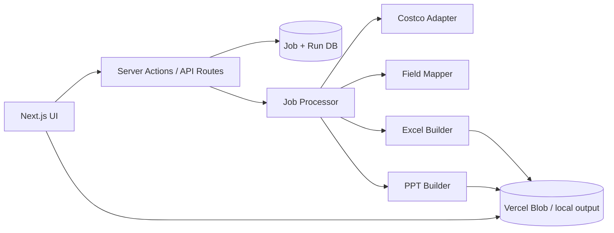

# Project Brief — Workflow Automate

## Elevator Pitch
Workflow Automate is a personal Next.js command center for daily automation tasks. The first workflow replaces a manual Costco product research routine: search by keyword, export a structured Excel report with pricing and product metadata, and refresh a PowerPoint slide of ongoing products — all from one UI.

## Problem Statement
The operator runs repetitive multi-step workflows daily: query a product source, filter fields, build Excel with pivot analysis, and update a presentation slide to a fixed format. Doing this manually in separate tools (browser, Excel, PowerPoint) is slow, error-prone, and hard to repeat consistently. Cost of inaction: ~30–60 minutes per reporting cycle and stale slide data.

## Target Users & Personas
### Primary
- **Ops Analyst (you)** — runs Costco product reports weekly or ad hoc; needs reliable exports matching existing Excel/PPT formats; technical enough to configure field maps.

### Secondary
- **Future self** — adds new automation modules to the same hub without rebuilding infrastructure.

## Value Proposition & Differentiation
- Single UI orchestrates fetch → transform → Excel → PPT end-to-end.
- Workflow modules are pluggable; Costco proves the pattern for future daily automations.
- Run history and re-downloadable artifacts replace scattered local files.

## Success Metrics
| Metric | Target | Timeframe |
|--------|--------|-----------|
| **North star:** Time from search submit to downloadable Excel + PPT | < 5 minutes (automated); < 2 min user active time | MVP |
| Successful run rate (no manual fix needed) | ≥ 90% | First 30 runs |
| Manual steps eliminated vs today | ≥ 80% reduction | MVP |
| Workflows added post-Costco | ≥ 1 additional module | 90 days post-MVP |

## User Journeys (MVP)
1. Open dashboard → select **Costco Product Report**.
2. Enter search term (e.g. "coconut") → optional warehouse/region if API supports → **Run**.
3. View job progress (fetching → transforming → generating Excel → updating PPT).
4. Download `.xlsx` (data + summary sheet with chart) and `.pptx` (updated ongoing-products slide).
5. (Optional) Open run history → re-download prior outputs.

## Functional Requirements (MVP)
| ID | Requirement | Acceptance criteria |
|----|-------------|---------------------|
| FR-01 | Workflow dashboard | Lists Costco pipeline; shows last run status and timestamp |
| FR-02 | Costco product search | User submits keyword; system fetches products via configured adapter; empty/error states shown |
| FR-03 | Field mapping & filter | API response mapped to canonical schema: `productName`, `originalPrice`, `promotionalPrice`, `manufacturer`, `expiryDate`, `sku`, `category` (+ extensible via config) |
| FR-04 | Excel generation | Produces `.xlsx` with **Data** sheet (all mapped rows) and **Summary** sheet (pivot-equivalent aggregation + chart per user spec) |
| FR-05 | PPT generation | Accepts user template; updates designated slide(s) with ongoing products in provided layout; outputs `.pptx` |
| FR-06 | Async job execution | Runs survive serverless limits; UI polls job status until complete/failed |
| FR-07 | Artifact storage | Completed files stored with run metadata; user can download from UI |
| FR-08 | Run history | Last N runs listed with search term, date, status, download links |

## Non-Functional Requirements
- **Performance:** Typical run (< 200 products) completes within 5 minutes.
- **Security:** API keys and Costco credentials server-only; never in client bundle.
- **Availability:** Personal tool; best-effort on Vercel; clear error messages on adapter failure.
- **Compliance:** Personal/internal use; user responsible for Costco data access terms.
- **Accessibility:** Dashboard WCAG AA basics (form labels, status announcements for job completion).

## Growth Strategy
- **ICP:** Single operator (personal productivity).
- **Channels:** N/A — not a commercial product in v1.
- **Activation:** First successful Costco run produces usable Excel + PPT.
- **Retention:** Adding workflow #2 validates platform; run history reduces rework.

## Architecture Overview

Personal automation hub with workflow registry, async job runner, and file artifact store.

### Components
- **Workflow registry** — metadata for each automation (Costco v1).
- **Costco adapter** — fetches/normalizes product data behind interface.
- **Field mapper** — config-driven JSON → canonical product schema.
- **Excel builder** — `exceljs`: data sheet + summary aggregation + embedded chart.
- **PPT builder** — template loader + placeholder fill for ongoing products table.
- **Job service** — create/poll/update job records; orchestrate pipeline steps.
- **Artifact store** — Blob storage with signed download URLs.

### Integrations
| Integration | Purpose |
|-------------|---------|
| Costco (TBD API/scrape) | Product search & details |
| Vercel Blob | Generated file storage |
| PostgreSQL + Prisma | Jobs, runs, workflow config |

### Key Technical Decisions
| Decision | Choice | Alternatives rejected |
|----------|--------|----------------------|
| Pivot output | Pre-computed summary sheet + chart | Native Excel PivotTable (poor JS library support) |
| PPT strategy | Template replacement | Build slides programmatically from scratch |
| Costco access | Adapter interface | Hard-coded fetch logic |
| Execution model | DB-backed async jobs | Synchronous server action (timeout risk) |
| Auth | None in v1 | NextAuth (unnecessary for single user initially) |

## Recommended Stack
| Layer | Choice | Notes |
|-------|--------|-------|
| Framework | Next.js App Router | Existing project choice |
| Styling | Tailwind CSS | Existing |
| Database | PostgreSQL + Prisma | Jobs, runs, config |
| Validation | Zod | API responses, job payloads |
| Excel | exceljs | Data + summary + chart |
| PPT | pptxgenjs or python-pptx sidecar | Spike against user template |
| Storage | Vercel Blob | Artifacts |
| Deployment | Vercel | Preview + prod |

## Implementation Phases
### Phase 1 — MVP (Costco pipeline)
- Scaffold Next.js app if not present; Prisma `Job`, `WorkflowRun`, `Artifact` models.
- Costco adapter spike with real API/script from user.
- Field mapper + Zod schema for product rows.
- Excel builder (data + summary + chart).
- PPT builder with user template.
- Dashboard UI: run form, job status, downloads, history.

### Phase 2 — Platform hardening
- Workflow registry pattern for workflow #2.
- Optional cron/scheduled runs.
- Python sidecar if Excel/PPT fidelity requires it.
- Basic auth if exposed beyond localhost.

### Phase 3 — Additional workflows
- Port other daily automations into same hub.
- Shared components: job runner, artifact store, config UI.

## Out of Scope (v1)
- Multi-user accounts and RBAC
- Public API or third-party access
- In-browser Excel/PPT editing
- Native Excel PivotTable refresh macros
- Workflows beyond Costco
- Mobile-native app

## Risks & Mitigations
- **Unknown Costco API** → User provides existing integration; time-boxed spike.
- **Template mismatch** → Early template delivery; visual diff checklist.
- **Serverless timeouts** → Async jobs with step-wise progress.
- **Schema drift** → Versioned field maps; log warnings for unmapped keys.

## Open Questions
- Exact Costco API endpoint, authentication, and sample response JSON.
- Complete Excel column list and pivot dimensions (group by category? manufacturer?).
- PPT template file and rules for "ongoing products" (which fields, sort order, max rows).
- Native PivotTable required or summary sheet acceptable?
- Expected product count per search.
